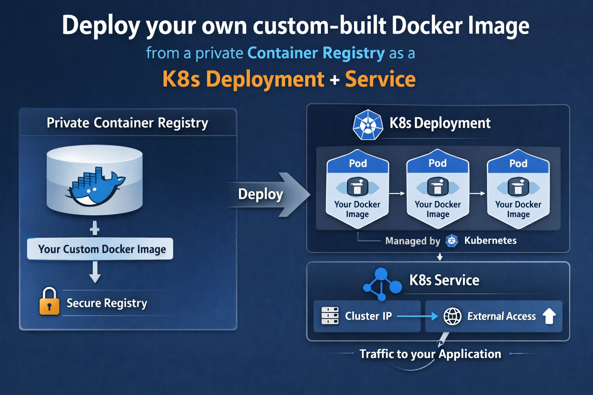
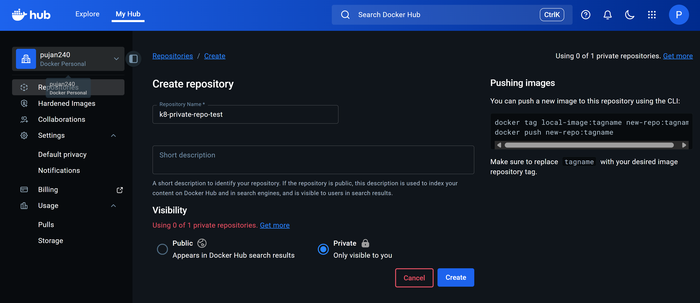
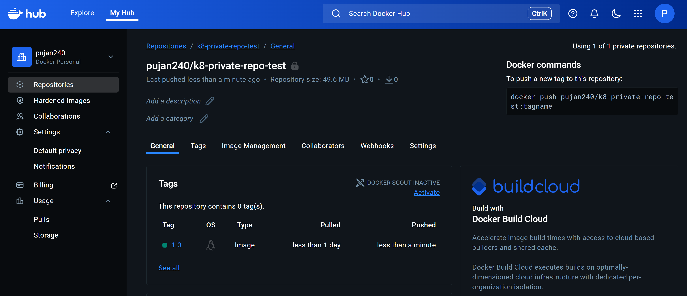
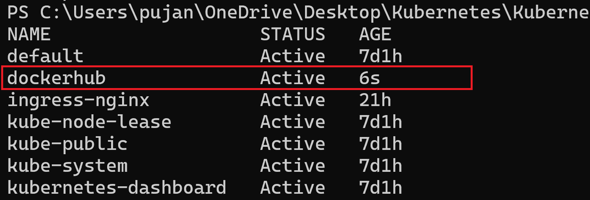
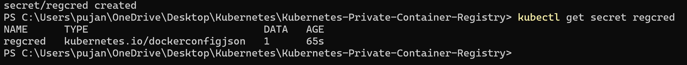
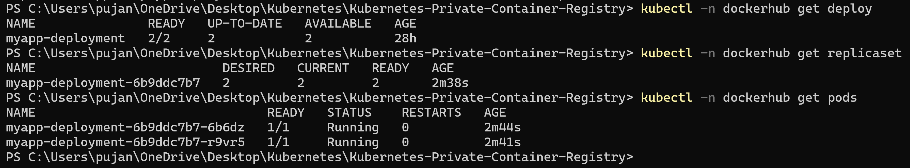
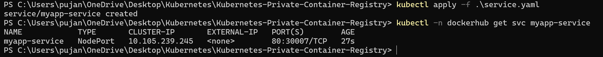
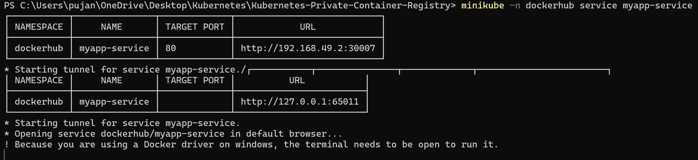
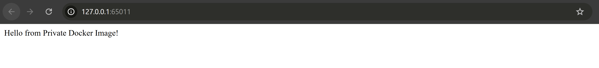

# Deploy your own custom-built Docker Image from a **Private Container Registry** as a **K8s Deployment+Service** with Documentation

This guide explains **end-to-end** how to deploy your **own custom-built Docker image** hosted in a **private container registry** as a **Kubernetes Deployment and Service**, with clear explanations and examples.


---

## Architecture Overview

```
Developer → Docker Build → Private Registry
                                ↓
                         Kubernetes Cluster
                         ├── Deployment (Pods)
                         └── Service (Networking)
```

---

## Prerequisites

- Docker installed
- Kubernetes cluster (Minikube / EKS / GKE / AKS)
- `kubectl` configured
- Access to a **private container registry** (Docker Hub / AWS ECR / Azure ACR / GCP GAR)

---

First, we create a private repo in DockerHub where we will be pushing our Docker Image file.



## Step 1: Build Your Custom Docker Image

Example application (`app.py`):

```python
from flask import Flask
app = Flask(__name__)

@app.route("/")
def hello():
    return "Hello from Private Docker Image!"

app.run(host="0.0.0.0", port=5000)
```

### Dockerfile

```dockerfile
FROM python:3.11-slim
WORKDIR /app
COPY app.py .
RUN pip install flask
EXPOSE 5000
CMD ["python", "app.py"]
```

Build the image:

```bash
docker build -t myapp:1.0 .
```

---

## Step 2: Push Image to a Private Registry

### Docker Hub Example

```bash
docker tag myapp:1.0 docker.io/<username>/myapp:1.0
docker login
docker push docker.io/<username>/myapp:1.0
```

> Image is now **private** by default if your repo is private.


---

Now, we will create a **Namespace** named `dockerhub`
```
kubectl create ns dockerhub
```


---
## Step 3: Create Kubernetes Image Pull Secret

Kubernetes needs credentials to pull private images.

```bash
kubectl create secret docker-registry regcred `
  --docker-server=docker.io `
  --docker-username=pujan240 `
  --docker-password=<enter-password-or-PAT> `
  --docker-email=pujanshrestha240 `
  -n dockerhub
```

Verify:

```bash
kubectl get secret regcred
```


---

## Step 4: Create Deployment YAML

```yaml
apiVersion: apps/v1
kind: Deployment
metadata:
  name: myapp-deployment
spec:
  replicas: 2
  selector:
    matchLabels:
      app: myapp
  template:
    metadata:
      labels:
        app: myapp
    spec:
      imagePullSecrets:
      - name: regcred
      containers:
      - name: myapp
        image: docker.io/pujan240/k8-private-repo-test:1.0
        ports:
        - containerPort: 5000
```

Apply:

```bash
kubectl apply -f deployment.yaml
```

---
## Step 5: Create Service YAML

```yaml
apiVersion: v1
kind: Service
metadata:
  name: myapp-service
  namespace: dockerhub
spec:
  type: NodePort
  selector:
    app: myapp
  ports:
  - port: 80
    targetPort: 5000
    nodePort: 30007
```

Apply:

```bash
kubectl apply -f service.yaml
```
Now, lets view the `Service`
```bash
kubectl -n dockerhub get svc
```


---
## Step 6: Access the Application
```
minikube -n dockerhub service myapp-service
```



---

## Common Errors & Fixes

### ImagePullBackOff
**Cause:** Wrong credentials or image name

**Fix:**
- Verify secret
- Check image path
- Recreate secret

```bash
kubectl delete secret regcred
```

---

## Security Best Practices

- Use **registry access tokens**, not passwords
- Scope IAM permissions (ECR/ACR/GAR)
- Avoid `latest` tag
- Scan images for vulnerabilities

---